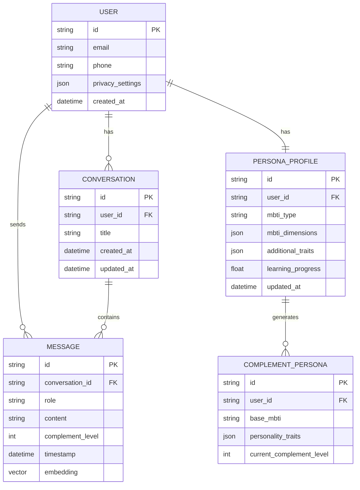

# 互补数字人 - 技术架构文档

## 1. Architecture Design

```mermaid
graph TB
    subgraph Frontend["前端层(小程序)
        A[微信小程序]
        B[React + Taro]
        C[UI组件库]
    end
    
    subgraph Backend["后端服务"]
        D[Supabase Auth]
        E[Node.js API服务]
        F[LLM集成层]
    end
    
    subgraph Data["数据层"]
        G[(Supabase PostgreSQL]
        H[(向量数据库)]
    end
    
    subgraph External["外部服务"]
        I[OpenAI/GPT-4]
        J[语音合成服务]
        K[对象存储]
    end
    
    A --&gt; B
    B --&gt; C
    B --&gt; D
    B --&gt; E
    E --&gt; F
    F --&gt; I
    F --&gt; J
    E --&gt; G
    E --&gt; H
    E --&gt; K
```

## 2. Technology Description

- **前端**: React@18 + Taro + tailwindcss@3
- **初始化工具**: Vite + Taro
- **后端**: Supabase (Auth/DB) + Node.js API服务
- **数据库**: Supabase PostgreSQL + 向量数据库
- **AI模型**: OpenAI GPT-4 / 国内大模型备选

## 3. Route Definitions

| Route | Purpose |
|-------|---------|
| /welcome | 欢迎引导页 |
| /mbti-test | MBTI测试页 |
| /chat-list | 聊天列表页 |
| /chat/:id | 对话详情页 |
| /settings | 设置页 |
| /persona | 人格档案页 |

## 4. API Definitions

```typescript
// 用户类型定义
interface User {
  id: string;
  mbtiType?: string;
  createdAt: Date;
  complementLevel: number; // 0-100
  privacySettings: PrivacySettings;
}

// 人格档案
interface PersonaProfile {
  mbti: {
    type: string;
    dimensions: {
      E: number; I: number;
      S: number; N: number;
      T: number; F: number;
      J: number; P: number;
    };
  };
  additionalTraits: Record&lt;string, number&gt;;
  learningProgress: number;
}

// 互补数字人
interface ComplementPersona {
  baseMbti: string;
  personalityTraits: Record&lt;string, number&gt;;
  voiceStyle?: string;
}

// 消息类型
interface Message {
  id: string;
  conversationId: string;
  role: 'user' | 'assistant';
  content: string;
  timestamp: Date;
  complementLevelAtTime: number;
}

// API接口
interface ChatRequest {
  userId: string;
  messages: Message[];
  complementLevel: number;
  useDecisionMode?: boolean;
}

interface ChatResponse {
  message: string;
  personaInsights?: string[];
}
```

## 5. Server Architecture Diagram

```mermaid
graph LR
    Controller[API控制器] --&gt; Service[业务服务层]
    Service --&gt; PersonaService[人格服务]
    Service --&gt; ChatService[聊天服务]
    Service --&gt; LLMWrapper[LLM包装器]
    PersonaService --&gt; Repository[数据访问层]
    ChatService --&gt; Repository
    LLMWrapper --&gt; OpenAI[OpenAI API]
    Repository --&gt; DB[(PostgreSQL)]
    Repository --&gt; VectorDB[(向量数据库)]
```

## 6. Data Model

### 6.1 Data Model Definition



### 6.2 Data Definition Language

```sql
-- 用户表
CREATE TABLE users (
    id UUID PRIMARY KEY DEFAULT gen_random_uuid(),
    email TEXT UNIQUE,
    phone TEXT UNIQUE,
    privacy_settings JSONB DEFAULT '{
        "storeConversations": true,
        "allowPersonalityLearning": true,
        "dataRetentionDays": 365
    }',
    created_at TIMESTAMPTZ DEFAULT NOW()
);

-- 人格档案表
CREATE TABLE persona_profiles (
    id UUID PRIMARY KEY DEFAULT gen_random_uuid(),
    user_id UUID REFERENCES users(id) ON DELETE CASCADE,
    mbti_type TEXT,
    mbti_dimensions JSONB,
    additional_traits JSONB DEFAULT '{}',
    learning_progress FLOAT DEFAULT 0,
    updated_at TIMESTAMPTZ DEFAULT NOW()
);

-- 互补数字人表
CREATE TABLE complement_personas (
    id UUID PRIMARY KEY DEFAULT gen_random_uuid(),
    user_id UUID REFERENCES users(id) ON DELETE CASCADE,
    base_mbti TEXT,
    personality_traits JSONB,
    current_complement_level INT DEFAULT 50,
    created_at TIMESTAMPTZ DEFAULT NOW()
);

-- 对话表
CREATE TABLE conversations (
    id UUID PRIMARY KEY DEFAULT gen_random_uuid(),
    user_id UUID REFERENCES users(id) ON DELETE CASCADE,
    title TEXT,
    created_at TIMESTAMPTZ DEFAULT NOW(),
    updated_at TIMESTAMPTZ DEFAULT NOW()
);

-- 消息表
CREATE TABLE messages (
    id UUID PRIMARY KEY DEFAULT gen_random_uuid(),
    conversation_id UUID REFERENCES conversations(id) ON DELETE CASCADE,
    role TEXT NOT NULL CHECK (role IN ('user', 'assistant')),
    content TEXT NOT NULL,
    complement_level INT DEFAULT 50,
    timestamp TIMESTAMPTZ DEFAULT NOW(),
    embedding vector(1536)
);

-- 创建索引
CREATE INDEX idx_messages_conversation ON messages(conversation_id, timestamp);
CREATE INDEX idx_persona_user ON persona_profiles(user_id);

-- RLS策略
ALTER TABLE users ENABLE ROW LEVEL SECURITY;
ALTER TABLE persona_profiles ENABLE ROW LEVEL SECURITY;
ALTER TABLE complement_personas ENABLE ROW LEVEL SECURITY;
ALTER TABLE conversations ENABLE ROW LEVEL SECURITY;
ALTER TABLE messages ENABLE ROW LEVEL SECURITY;

CREATE POLICY "用户只能访问自己的数据" ON users
    FOR ALL USING (auth.uid()::text = id::text);

CREATE POLICY "用户只能访问自己的人格档案" ON persona_profiles
    FOR ALL USING (auth.uid()::text = user_id::text);

CREATE POLICY "用户只能访问自己的对话" ON conversations
    FOR ALL USING (auth.uid()::text = user_id::text);

CREATE POLICY "用户只能访问自己的消息" ON messages
    FOR ALL USING (EXISTS (
        SELECT 1 FROM conversations 
        WHERE conversations.id = messages.conversation_id 
        AND conversations.user_id::text = auth.uid()::text
    ));
```
