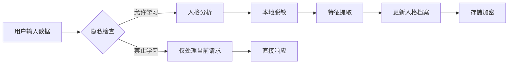

# 互补数字人 - 隐私保护方案与实施路线图

## 1. 隐私保护方案

### 1.1 隐私设置选项

**用户可自行选择数据存储模式**，提供三种模式：

| Storage Mode | Description | Data Security | Best For |
|-------------|-------------|---------------|----------|
| **本地存储** | 数据仅保存在用户设备 | 高（数据不出设备） | 极度注重隐私的用户 |
| **云端加密存储** | 数据加密后保存在服务器 | 中（加密保护） | 多设备同步需求的用户 |
| **混合模式** | 基础数据本地，偏好设置云端 | 中高 | 平衡隐私和便利性 |

### 1.2 额外隐私控制选项

| 选项 | 默认值 | 描述 |
|------|--------|------|
| 存储对话历史 | 开启 | 保存聊天记录用于人格学习 |
| 允许人格学习 | 开启 | 从对话中分析用户人格特征 |
| 数据保留期限 | 365天 | 自动删除超期数据 |
| 数据分析用途 | 仅改进服务 | 不用于第三方营销 |
| 数据加密 | 强制开启 | 端到端加密传输和存储 |

### 1.3 数据分类与处理策略

```typescript
// 数据分类
enum DataSensitivity {
  PUBLIC = 'public',           // 非敏感
  INTERNAL = 'internal',       // 一般敏感
  CONFIDENTIAL = 'confidential' // 高度敏感
}

// 用户人格档案 - CONFIDENTIAL
// 对话内容 - CONFIDENTIAL
// 基本信息 - INTERNAL
// 匿名使用统计 - PUBLIC
```

### 1.4 数据处理流程



### 1.5 用户数据控制权

- **数据导出**: 一键导出所有个人数据（JSON格式）
- **数据删除**: 
  - 删除单条对话
  - 清空全部历史
  - 删除人格档案
  - 完全注销账户（不可逆）
- **学习暂停**: 随时暂停/恢复人格学习功能
- **人格重置**: 每月一次免费重置机会

### 1.6 技术保障措施

- **端到端加密**: TLS 1.3传输加密
- **静态加密**: AES-256存储加密
- **数据最小化**: 只存储必要信息
- **匿名化处理**: 分析时去除个人标识
- **安全审计**: 所有数据访问留痕

---

## 2. 实施路线图

### 2.1 优先策略

**优先选择开发难度低的方案**，后续再具体延申补充：

**第一阶段**: 微信小程序 / Web网页版
- 开发难度低
- 便于快速验证产品概念
- 用户获取成本低

**第二阶段**: 独立App（iOS/Android）
- 更好的用户体验
- 更多系统能力

**第三阶段**: 多平台统一
- 跨平台数据同步
- 统一用户体验

### 2.2 阶段一：MVP（最小可行产品）- 1.5-2个月

**目标**: 验证核心概念，实现基础功能

| 任务 | 工作量 | 交付物 |
|------|--------|--------|
| 项目框架搭建 | 3天 | Web/小程序项目骨架 |
| MBTI测试模块（简化版） | 5天 | 6-12题测试+结果展示 |
| 单人格档案系统 | 5天 | 基础人格管理 |
| 基础聊天界面 | 5天 | 对话列表+聊天页 |
| AI对话能力 | 5天 | GPT-4/文心一言集成 |
| 互补人格提示词 | 3天 | 基础人格设定 |
| 决策模式（带说明） | 5天 | 结构化分析+?说明 |
| MVP测试与调优 | 5天 | 可演示版本 |

**MVP功能范围**:
- ✅ MBTI测试（简化版）
- ✅ 基础文字聊天
- ✅ 单人格档案
- ✅ 互补度调节（每月一次限制）
- ✅ 决策模式（带说明）
- ✅ 本地存储

### 2.3 阶段二：多人格支持 - 2个月

**目标**: 实现多人格并存系统

| 任务 | 工作量 | 交付物 |
|------|--------|--------|
| 多人格架构设计 | 5天 | 人格数据结构设计 |
| 人格创建/切换 | 5天 | 最多5个人格 |
| 人格命名系统 | 3天 | 自定义+建议名称 |
| 互补度独立管理 | 5天 | 每个人格独立限制 |
| 被动成长系统 | 8天 | 时间衰减权重算法 |
| 主动成长系统 | 7天 | 标记反馈机制 |
| 云端存储选项 | 5天 | 多设备同步 |
| 阶段二测试 | 5天 | Beta版本 |

**阶段二功能范围**:
- ✅ 最多5个人格档案
- ✅ 人格切换功能
- ✅ 人格独立管理
- ✅ 被动+主动成长
- ✅ 云端存储选项

### 2.4 阶段三：智能成长与优化 - 2个月

**目标**: 提升人格学习能力，优化用户体验

| 任务 | 工作量 | 交付物 |
|------|--------|--------|
| 人格蒸馏算法优化 | 10天 | 更精准的学习 |
| 客观性增强 | 7天 | 事实判断机制 |
| 人格档案可视化 | 7天 | 雷达图+进度展示 |
| UI/UX全面优化 | 10天 | 精美界面+动画 |
| 性能优化 | 5天 | 响应速度提升 |
| 高级隐私设置 | 5天 | 完整的隐私控制 |
| 阶段三测试 | 5天 | 发布候选版 |

**阶段三功能范围**:
- ✅ 更智能的人格学习
- ✅ 客观性增强
- ✅ 成长可视化
- ✅ 完整隐私控制

### 2.5 阶段四：平台扩展与高级功能 - 持续迭代

**目标**: 探索高级功能，扩大平台覆盖

| 任务 | 优先级 | 说明 |
|------|--------|------|
| 独立App开发 | 高 | iOS/Android原生应用 |
| 虚拟形象（可选） | 中 | 2D/3D数字人形象 |
| 语音对话（可选） | 中 | 语音输入/输出 |
| 多平台适配 | 中 | 支付宝、抖音小程序 |
| 3D虚拟形象 | 低 | 更沉浸的体验 |
| AR/VR集成 | 低 | 探索性功能 |
| API开放 | 低 | 开发者生态 |

---

## 3. 技术栈详细说明

### 3.1 前端技术

**第一阶段（Web/小程序）**:
```json
{
  "framework": "React + Vite",
  "ui": "React 18 + TypeScript",
  "styling": "Tailwind CSS 3",
  "state": "Zustand",
  "charts": "Recharts",
  "icons": "lucide-react",
  "platform": "Web / 微信小程序"
}
```

**第二阶段（独立App）**:
```json
{
  "framework": "Taro 3.x / React Native",
  "ui": "React + TypeScript",
  "styling": "Tailwind CSS / Native Styles",
  "state": "Zustand / Redux Toolkit"
}
```

### 3.2 后端技术

```json
{
  "auth": "Supabase Auth",
  "database": "Supabase PostgreSQL",
  "vector": "pgvector",
  "api": "Node.js + Express / Next.js",
  "llm": "OpenAI GPT-4 / 文心一言",
  "deployment": "Vercel / 阿里云"
}
```

### 3.3 AI能力

**当前策略**: 完全依赖AI，不引入真人审核或人工干预

- **AI模型选择**: 根据平台和成本选择合适的模型
  - Web版本: GPT-4 (高质量)
  - 小程序版本: 文心一言 (成本效益)
- **对话生成**: 支持流式输出，提升响应体验
- **人格学习**: 完全自动化，无需人工介入

### 3.4 开发工具

- 版本控制: Git + GitHub
- 项目管理: GitHub Projects / Notion
- 设计工具: Figma
- API测试: Postman
- 日志监控: Sentry

---

## 4. 风险评估与应对

| 风险 | 可能性 | 影响 | 应对措施 |
|------|--------|------|----------|
| API成本过高 | 中 | 高 | 引入用户分级+请求节流 |
| 用户隐私担忧 | 高 | 中 | 透明隐私政策+强加密+本地存储选项 |
| 人格学习不准确 | 中 | 中 | 持续优化算法+用户反馈标记 |
| 多个人格管理混乱 | 中 | 中 | 清晰的人格切换界面+独立管理 |
| 小程序审核不通过 | 低 | 高 | 提前准备审核材料+合规内容 |
| AI客观性不足 | 中 | 高 | 事实判断机制+不迎合原则 |
| 技术栈学习曲线 | 低 | 低 | 使用成熟技术+文档完善 |

---

## 5. 产品成功指标

### 5.1 用户指标

- **日活跃用户(DAU)**: 目标首月100，6个月1000
- **用户留存率**: 次日留存>40%，7日留存>20%，30日留存>10%
- **人均对话轮次**: 平均每次会话>10轮
- **决策模式使用率**: >30%的用户使用过

### 5.2 产品指标

- **人格使用分布**: 验证多人格需求
- **互补度调节频率**: 验证限制是否合理
- **用户满意度**: NPS评分>40
- **对话质量评分**: 用户评分>4.0/5.0

### 5.3 技术指标

- **响应时间**: P95<3秒
- **AI准确率**: 人格一致性评分>85%
- **系统可用性**: 99.5%以上

---

**文档版本**: 1.1
**更新日期**: 2025年
**状态**: 进行中
