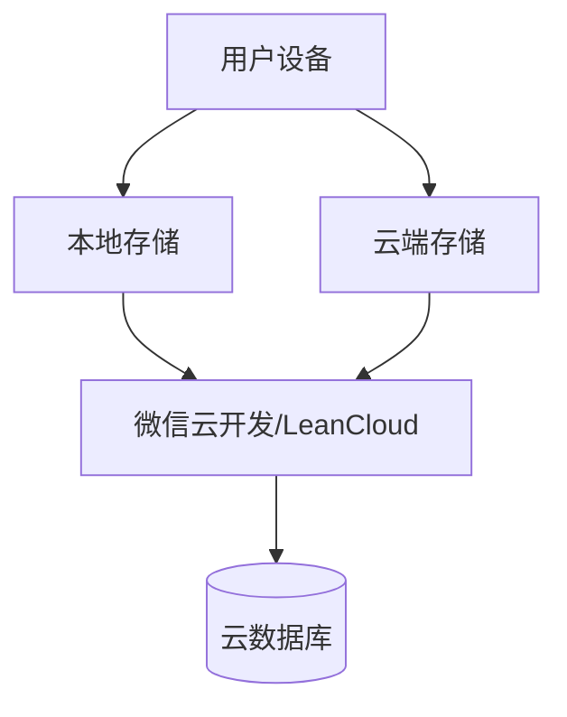
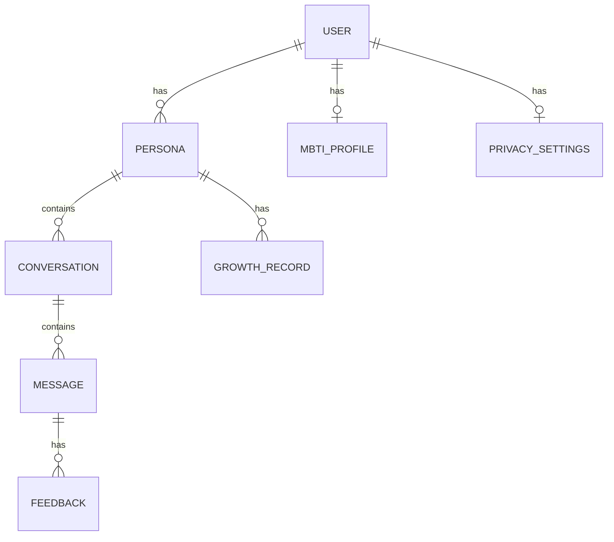

# 互补数字人 - 技术架构设计文档

## 1. 技术选型

### 1.1 小程序框架选型

**推荐方案：uni-app**

| 方案 | 优点 | 缺点 | 适用场景 |
|------|------|------|----------|
| **uni-app** ⭐ | 一套代码多端运行，生态完善，学习成本低 | 包体积相对较大 | 快速上线多平台 |
| Taro | React生态，兼容React语法 | 多端适配需要额外处理 | 已有React团队 |
| 微信原生 | 性能最优，官方支持 | 代码不能复用，维护成本高 | 单小程序，团队充足 |

**选择理由**：
- 开发效率高，一次开发可发布微信/支付宝/抖音等多平台
- Vue语法对初学者友好
- 社区活跃，插件丰富
- 支持本地存储和云开发

### 1.2 AI接口选型

**推荐方案：文心一言（百度）**

| AI服务 | 优点 | 缺点 | 成本 |
|--------|------|------|------|
| **文心一言** ⭐ | 中文理解强，成本低，国内合规 | 英文能力相对弱 | ¥0.012-0.12/千tokens |
| GPT-4 | 通用能力强，质量高 | 成本高，需要API Key代理 | $0.03-0.12/千tokens |
| 通义千问 | 阿里生态，中文优秀 | 生态相对年轻 | ¥0.004-0.12/千tokens |

**选择理由**：
- 国内合规，无需担心政策风险
- 中文理解能力强（适合人格对话）
- 成本可控，适合初创项目
- 提供人格定制API

### 1.3 数据存储方案

**三层存储架构**：



**存储策略**：

| 数据类型 | 存储位置 | 说明 |
|---------|---------|------|
| 对话历史 | 本地优先 | 大数据量，本地优先 |
| 人格档案 | 云端同步 | 核心数据，多设备同步 |
| MBTI档案 | 云端+本地 | 基础数据，双重保障 |
| 用户设置 | 本地 | 频繁读写，本地足够 |
| 敏感信息 | 云端加密 | 加密存储 |

### 1.4 技术栈总览

```yaml
前端框架: uni-app + Vue 3
编程语言: TypeScript
状态管理: Pinia
UI组件: uView UI / Vant Weapp
云服务: 微信云开发 / LeanCloud
AI服务: 文心一言
版本控制: Git + GitHub
```

---

## 2. 数据库设计

### 2.1 ER图



### 2.2 数据表设计

#### 2.2.1 用户表 (users)

```sql
CREATE TABLE users (
  id VARCHAR(64) PRIMARY KEY,           -- 微信OpenID
  created_at TIMESTAMP DEFAULT NOW(),
  updated_at TIMESTAMP DEFAULT NOW(),
  last_login_at TIMESTAMP,               -- 最后登录时间
  status TINYINT DEFAULT 1,             -- 1:正常 0:禁用
  settings JSON,                          -- 通用设置
  
  INDEX idx_created_at (created_at),
  INDEX idx_status (status)
);
```

#### 2.2.2 MBTI档案表 (mbti_profiles)

```sql
CREATE TABLE mbti_profiles (
  id VARCHAR(64) PRIMARY KEY,
  user_id VARCHAR(64) NOT NULL,
  mbti_type CHAR(4) NOT NULL,          -- 如: INTJ
  answers JSON NOT NULL,                 -- 原始答案
  completed_at TIMESTAMP,                -- 完成时间
  version INT DEFAULT 1,                 -- 版本号
  created_at TIMESTAMP DEFAULT NOW(),
  
  FOREIGN KEY (user_id) REFERENCES users(id) ON DELETE CASCADE,
  INDEX idx_user_id (user_id),
  INDEX idx_mbti_type (mbti_type)
);
```

#### 2.2.3 人格档案表 (personas)

```sql
CREATE TABLE personas (
  id VARCHAR(64) PRIMARY KEY,
  user_id VARCHAR(64) NOT NULL,
  name VARCHAR(100) NOT NULL,           -- 用户自定义名称
  suggested_name VARCHAR(50),             -- 系统建议名称
  mbti_type CHAR(4) NOT NULL,          -- 用户MBTI
  complement_mbti CHAR(4) NOT NULL,     -- 互补MBTI
  complement_level INT DEFAULT 50,       -- 互补度 0-100
  tags JSON,                             -- 人格标签
  
  -- 限制控制
  created_at TIMESTAMP DEFAULT NOW(),
  last_modified_at TIMESTAMP DEFAULT NOW(),
  next_modify_time TIMESTAMP,            -- 下次可修改时间
  
  -- 成长数据
  total_conversations INT DEFAULT 0,
  growth_level INT DEFAULT 1,
  growth_score DECIMAL(10,2) DEFAULT 0,
  
  -- 状态
  is_active BOOLEAN DEFAULT TRUE,        -- 是否当前使用
  status TINYINT DEFAULT 1,
  
  FOREIGN KEY (user_id) REFERENCES users(id) ON DELETE CASCADE,
  INDEX idx_user_id (user_id),
  INDEX idx_created_at (created_at),
  INDEX idx_is_active (is_active)
);
```

#### 2.2.4 对话表 (conversations)

```sql
CREATE TABLE conversations (
  id VARCHAR(64) PRIMARY KEY,
  persona_id VARCHAR(64) NOT NULL,
  user_id VARCHAR(64) NOT NULL,
  title VARCHAR(200),                    -- 对话标题
  mode VARCHAR(20) DEFAULT 'normal',      -- normal/decision
  message_count INT DEFAULT 0,
  last_message_at TIMESTAMP,
  created_at TIMESTAMP DEFAULT NOW(),
  
  FOREIGN KEY (persona_id) REFERENCES personas(id) ON DELETE CASCADE,
  FOREIGN KEY (user_id) REFERENCES users(id) ON DELETE CASCADE,
  INDEX idx_persona_id (persona_id),
  INDEX idx_user_id (user_id),
  INDEX idx_created_at (created_at)
);
```

#### 2.2.5 消息表 (messages)

```sql
CREATE TABLE messages (
  id VARCHAR(64) PRIMARY KEY,
  conversation_id VARCHAR(64) NOT NULL,
  persona_id VARCHAR(64) NOT NULL,
  role ENUM('user', 'assistant') NOT NULL,
  content TEXT NOT NULL,
  metadata JSON,                         -- 额外信息（决策分析等）
  created_at TIMESTAMP DEFAULT NOW(),
  
  FOREIGN KEY (conversation_id) REFERENCES conversations(id) ON DELETE CASCADE,
  FOREIGN KEY (persona_id) REFERENCES personas(id) ON DELETE CASCADE,
  INDEX idx_conversation_id (conversation_id),
  INDEX idx_created_at (created_at)
);
```

#### 2.2.6 反馈表 (feedbacks)

```sql
CREATE TABLE feedbacks (
  id VARCHAR(64) PRIMARY KEY,
  message_id VARCHAR(64) NOT NULL,
  user_id VARCHAR(64) NOT NULL,
  persona_id VARCHAR(64) NOT NULL,
  is_positive BOOLEAN,                   -- true:这个回答更好
  created_at TIMESTAMP DEFAULT NOW(),
  
  FOREIGN KEY (message_id) REFERENCES messages(id) ON DELETE CASCADE,
  FOREIGN KEY (user_id) REFERENCES users(id) ON DELETE CASCADE,
  FOREIGN KEY (persona_id) REFERENCES personas(id) ON DELETE CASCADE,
  INDEX idx_message_id (message_id),
  INDEX idx_persona_id (persona_id)
);
```

#### 2.2.7 成长记录表 (growth_records)

```sql
CREATE TABLE growth_records (
  id VARCHAR(64) PRIMARY KEY,
  persona_id VARCHAR(64) NOT NULL,
  trait_name VARCHAR(100) NOT NULL,      -- 特征名称
  trait_value DECIMAL(5,2) NOT NULL,     -- 特征值
  weight DECIMAL(5,2) DEFAULT 1.0,       -- 权重
  source VARCHAR(20),                    -- passive/active
  source_detail JSON,                    -- 来源详情
  conversation_id VARCHAR(64),
  created_at TIMESTAMP DEFAULT NOW(),
  
  FOREIGN KEY (persona_id) REFERENCES personas(id) ON DELETE CASCADE,
  INDEX idx_persona_id (persona_id),
  INDEX idx_trait_name (trait_name),
  INDEX idx_created_at (created_at)
);
```

#### 2.2.8 隐私设置表 (privacy_settings)

```sql
CREATE TABLE privacy_settings (
  id VARCHAR(64) PRIMARY KEY,
  user_id VARCHAR(64) NOT NULL UNIQUE,
  storage_mode ENUM('local', 'cloud', 'hybrid') DEFAULT 'local',
  store_conversation_history BOOLEAN DEFAULT TRUE,
  allow_personality_learning BOOLEAN DEFAULT TRUE,
  data_retention_days INT DEFAULT 365,
  data_usage ENUM('service_only', 'analytics') DEFAULT 'service_only',
  updated_at TIMESTAMP DEFAULT NOW(),
  
  FOREIGN KEY (user_id) REFERENCES users(id) ON DELETE CASCADE
);
```

---

## 3. API接口设计

### 3.1 API概览

```
Base URL: https://api.example.com/v1

认证方式: 微信授权登录 (Bearer Token)
数据格式: JSON
编码: UTF-8
```

### 3.2 认证接口

#### POST /auth/login
微信登录

```typescript
// Request
{
  code: string;  // 微信授权码
}

// Response
{
  success: boolean;
  data: {
    token: string;
    user_id: string;
    is_new_user: boolean;
  };
  message: string;
}
```

### 3.3 MBTI测试接口

#### POST /mbti/test/start
开始测试

```typescript
// Response
{
  success: boolean;
  data: {
    test_id: string;
    questions: Array<{
      id: number;
      dimension: string;
      question: string;
      options: string[];
    }>;
    total_count: number;
  };
}
```

#### POST /mbti/test/submit
提交测试答案

```typescript
// Request
{
  test_id: string;
  answers: Array<{
    question_id: number;
    selected_option: number;  // 0 或 1
  }>;
}

// Response
{
  success: boolean;
  data: {
    mbti_type: string;        // 如: "INTJ"
    description: string;
    traits: Array<{
      dimension: string;
     倾向: string;
      description: string;
    }>;
  };
}
```

#### GET /mbti/profile
获取MBTI档案

```typescript
// Response
{
  success: boolean;
  data: {
    id: string;
    mbti_type: string;
    completed_at: string;
    version: number;
  };
}
```

### 3.4 人格档案接口

#### POST /personas
创建新人格

```typescript
// Request
{
  name: string;
  mbti_profile_id?: string;  // 可选，使用已有MBTI或新建
  initial_complement_level?: number;  // 默认50
  tags?: string[];
}

// Response
{
  success: boolean;
  data: {
    id: string;
    name: string;
    mbti_type: string;
    complement_mbti: string;
    complement_level: number;
    created_at: string;
    next_modify_time: string;
  };
}
```

#### GET /personas
获取所有人格

```typescript
// Response
{
  success: boolean;
  data: {
    personas: Array<{
      id: string;
      name: string;
      complement_mbti: string;
      complement_level: number;
      created_at: string;
      total_conversations: number;
      growth_level: number;
      is_active: boolean;
    }>;
    total_count: number;
    max_count: number;  // 5
  };
}
```

#### GET /personas/:id
获取特定人格详情

```typescript
// Response
{
  success: boolean;
  data: {
    id: string;
    name: string;
    suggested_name: string;
    mbti_type: string;
    complement_mbti: string;
    complement_level: number;
    tags: string[];
    created_at: string;
    next_modify_time: string;
    can_modify: boolean;      // 是否可以修改
    modify_remaining_days: number;  // 距离可修改的天数
    total_conversations: number;
    growth_level: number;
    traits: Array<{
      name: string;
      value: number;
      confidence: number;
    }>;
  };
}
```

#### PATCH /personas/:id
更新人格设置

```typescript
// Request
{
  name?: string;
  complement_level?: number;  // 0-100
  is_active?: boolean;
}

// Response
{
  success: boolean;
  data: {
    id: string;
    next_modify_time: string;  // 更新后会刷新
    message: string;  // 如: "互补度已更新，下次可修改时间: 2025-xx-xx"
  };
}
```

#### DELETE /personas/:id
删除人格

```typescript
// Response
{
  success: boolean;
  message: string;
}
```

#### POST /personas/:id/reset
重置人格（每月一次）

```typescript
// Response
{
  success: boolean;
  data: {
    reset_available: boolean;
    next_reset_time?: string;
    message: string;
  };
}
```

### 3.5 对话接口

#### POST /conversations
创建新对话

```typescript
// Request
{
  persona_id: string;
  mode?: 'normal' | 'decision';  // 默认 normal
  title?: string;
}

// Response
{
  success: boolean;
  data: {
    id: string;
    persona_id: string;
    mode: string;
    created_at: string;
  };
}
```

#### GET /conversations
获取对话列表

```typescript
// Query: ?persona_id=xxx&page=1&limit=20

// Response
{
  success: boolean;
  data: {
    conversations: Array<{
      id: string;
      persona_id: string;
      persona_name: string;
      title: string;
      mode: string;
      message_count: number;
      last_message_at: string;
      created_at: string;
    }>;
    pagination: {
      page: number;
      limit: number;
      total: number;
      total_pages: number;
    };
  };
}
```

#### POST /conversations/:id/messages
发送消息

```typescript
// Request
{
  content: string;
  mode?: 'normal' | 'decision';  // 可临时切换模式
}

// Response
{
  success: boolean;
  data: {
    message_id: string;
    content: string;
    mode: string;
    metadata?: {
      decision_analysis?: {
        problem_statement: string;
        pros_cons: object;
        key_questions: string[];
      };
    };
    created_at: string;
  };
}
```

#### GET /conversations/:id/messages
获取对话历史

```typescript
// Query: ?page=1&limit=50

// Response
{
  success: boolean;
  data: {
    messages: Array<{
      id: string;
      role: 'user' | 'assistant';
      content: string;
      metadata: object;
      feedback?: {
        is_positive: boolean;
        created_at: string;
      };
      created_at: string;
    }>;
    pagination: object;
  };
}
```

### 3.6 反馈接口

#### POST /feedbacks
提交反馈

```typescript
// Request
{
  message_id: string;
  is_positive: boolean;
}

// Response
{
  success: boolean;
  message: string;
}
```

### 3.7 设置接口

#### GET /settings/privacy
获取隐私设置

```typescript
// Response
{
  success: boolean;
  data: {
    storage_mode: string;
    store_conversation_history: boolean;
    allow_personality_learning: boolean;
    data_retention_days: number;
    data_usage: string;
  };
}
```

#### PUT /settings/privacy
更新隐私设置

```typescript
// Request
{
  storage_mode?: string;
  store_conversation_history?: boolean;
  allow_personality_learning?: boolean;
  data_retention_days?: number;
}

// Response
{
  success: boolean;
  message: string;
}
```

#### POST /settings/export
导出数据

```typescript
// Response
{
  success: boolean;
  data: {
    download_url: string;  // 临时下载链接
    expires_at: string;
  };
}
```

#### DELETE /settings/account
删除账户

```typescript
// Request
{
  confirm: boolean;
  reason?: string;
}

// Response
{
  success: boolean;
  message: string;
}
```

### 3.8 错误码规范

```typescript
const ErrorCodes = {
  // 通用错误 (1000-1999)
  SUCCESS: 0,
  UNKNOWN_ERROR: 1000,
  INVALID_PARAMS: 1001,
  UNAUTHORIZED: 1002,
  FORBIDDEN: 1003,
  NOT_FOUND: 1004,
  
  // 认证错误 (2000-2999)
  AUTH_FAILED: 2000,
  TOKEN_EXPIRED: 2001,
  
  // MBTI测试错误 (3000-3999)
  TEST_NOT_FOUND: 3000,
  TEST_INCOMPLETE: 3001,
  ALREADY_COMPLETED: 3002,
  
  // 人格错误 (4000-4999)
  PERSONA_LIMIT_EXCEEDED: 4000,
  PERSONA_NOT_FOUND: 4001,
  MODIFY_COOLDOWN: 4002,         // 修改冷却中
  RESET_NOT_AVAILABLE: 4003,     // 重置不可用
  MODIFY_LIMIT_EXCEEDED: 4004,   // 超过修改限制
  
  // 对话错误 (5000-5999)
  CONVERSATION_NOT_FOUND: 5000,
  AI_SERVICE_ERROR: 5001,
  MESSAGE_TOO_LONG: 5002,
  
  // 设置错误 (6000-6999)
  STORAGE_MODE_NOT_ALLOWED: 6000,
  EXPORT_FAILED: 6001,
};
```

---

## 4. 代码架构设计

### 4.1 项目目录结构

```
complement-digital-human/
├── src/
│   ├── api/                    # API接口层
│   │   ├── index.ts           # API统一导出
│   │   ├── auth.ts            # 认证接口
│   │   ├── mbti.ts            # MBTI接口
│   │   ├── persona.ts         # 人格接口
│   │   ├── conversation.ts    # 对话接口
│   │   ├── feedback.ts        # 反馈接口
│   │   └── settings.ts       # 设置接口
│   │
│   ├── components/            # 公共组件
│   │   ├── common/           # 通用组件
│   │   │   ├── Button.vue
│   │   │   ├── Card.vue
│   │   │   ├── Input.vue
│   │   │   └── Modal.vue
│   │   │
│   │   ├── mbti/             # MBTI组件
│   │   │   ├── QuestionCard.vue
│   │   │   └── ResultDisplay.vue
│   │   │
│   │   ├── persona/          # 人格组件
│   │   │   ├── PersonaCard.vue
│   │   │   ├── ComplementSlider.vue
│   │   │   └── PersonaSwitcher.vue
│   │   │
│   │   ├── chat/             # 聊天组件
│   │   │   ├── MessageBubble.vue
│   │   │   ├── MessageInput.vue
│   │   │   ├── DecisionMode.vue
│   │   │   └── ModeToggle.vue
│   │   │
│   │   └── layout/           # 布局组件
│   │       ├── Header.vue
│   │       ├── TabBar.vue
│   │       └── PageContainer.vue
│   │
│   ├── pages/                 # 页面
│   │   ├── index/            # 首页/欢迎页
│   │   ├── mbti/             # MBTI测试
│   │   ├── persona/          # 人格档案
│   │   │   ├── index.vue     # 人格列表
│   │   │   ├── create.vue    # 创建人格
│   │   │   └── detail.vue    # 人格详情
│   │   ├── chat/             # 聊天页面
│   │   │   ├── index.vue     # 对话列表
│   │   │   └── [id].vue      # 具体对话
│   │   └── settings/         # 设置页面
│   │       ├── index.vue    # 设置列表
│   │       ├── privacy.vue   # 隐私设置
│   │       └── about.vue     # 关于我们
│   │
│   ├── stores/               # 状态管理
│   │   ├── index.ts         # store统一导出
│   │   ├── auth.ts          # 认证状态
│   │   ├── mbti.ts          # MBTI状态
│   │   ├── persona.ts       # 人格状态
│   │   ├── conversation.ts  # 对话状态
│   │   └── settings.ts      # 设置状态
│   │
│   ├── utils/                # 工具函数
│   │   ├── request.ts       # 请求封装
│   │   ├── storage.ts       # 本地存储
│   │   ├── date.ts          # 日期处理
│   │   ├── validate.ts      # 表单验证
│   │   └── mbti.ts          # MBTI计算
│   │
│   ├── constants/            # 常量定义
│   │   ├── index.ts
│   │   ├── mbti.ts          # MBTI相关常量
│   │   ├── persona.ts       # 人格建议名称
│   │   └── api.ts            # API常量
│   │
│   ├── types/                # TypeScript类型
│   │   ├── index.ts
│   │   ├── user.ts
│   │   ├── mbti.ts
│   │   ├── persona.ts
│   │   ├── conversation.ts
│   │   └── api.ts
│   │
│   ├── static/               # 静态资源
│   │   ├── images/
│   │   ├── icons/
│   │   └── fonts/
│   │
│   ├── App.vue               # 应用入口
│   ├── main.ts               # 主入口文件
│   ├── manifest.json          # uni-app配置
│   ├── pages.json            # 页面路由配置
│   └── uni.scss              # 全局样式
│
├── server/                    # 后端代码（可选）
│   ├── src/
│   │   ├── controllers/
│   │   ├── services/
│   │   ├── models/
│   │   ├── routes/
│   │   ├── middleware/
│   │   └── utils/
│   └── package.json
│
├── docs/                     # 文档
├── README.md
├── package.json
└── tsconfig.json
```

### 4.2 核心模块设计

#### 4.2.1 请求封装 (request.ts)

```typescript
import { getToken } from './storage';

interface RequestConfig {
  url: string;
  method?: 'GET' | 'POST' | 'PUT' | 'PATCH' | 'DELETE';
  data?: any;
  params?: Record<string, any>;
  header?: Record<string, string>;
}

interface ResponseData<T = any> {
  success: boolean;
  data?: T;
  message?: string;
  code?: number;
}

class Request {
  private baseURL = 'https://api.example.com/v1';
  
  async request<T>(config: RequestConfig): Promise<ResponseData<T>> {
    const token = getToken();
    
    const header: Record<string, string> = {
      'Content-Type': 'application/json',
      ...config.header,
    };
    
    if (token) {
      header['Authorization'] = `Bearer ${token}`;
    }
    
    // 处理URL参数
    let url = config.url;
    if (config.params) {
      const queryString = Object.entries(config.params)
        .map(([key, value]) => `${key}=${encodeURIComponent(value)}`)
        .join('&');
      url += `?${queryString}`;
    }
    
    try {
      const response = await uni.request({
        url: `${this.baseURL}${url}`,
        method: config.method || 'GET',
        data: config.data,
        header,
      });
      
      return response.data as ResponseData<T>;
    } catch (error) {
      return {
        success: false,
        message: '网络请求失败',
        code: 1000,
      };
    }
  }
  
  get<T>(url: string, params?: Record<string, any>) {
    return this.request<T>({ url, method: 'GET', params });
  }
  
  post<T>(url: string, data?: any) {
    return this.request<T>({ url, method: 'POST', data });
  }
  
  put<T>(url: string, data?: any) {
    return this.request<T>({ url, method: 'PUT', data });
  }
  
  patch<T>(url: string, data?: any) {
    return this.request<T>({ url, method: 'PATCH', data });
  }
  
  delete<T>(url: string) {
    return this.request<T>({ url, method: 'DELETE' });
  }
}

export const request = new Request();
```

#### 4.2.2 MBTI计算工具 (mbti.ts)

```typescript
interface MBTIResult {
  type: string;
  dimensions: {
    EI: number;  // 0-100, >50=E, <50=I
    SN: number;
    TF: number;
    JP: number;
  };
}

export function calculateMBTI(answers: number[]): MBTIResult {
  const dimensions = {
    EI: 0,  // E/I
    SN: 0,  // S/N
    TF: 0,  // T/F
    JP: 0,  // J/P
  };
  
  // 计算每个维度的倾向
  // 简化版：每道题0或1，直接累加
  dimensions.EI = (answers[0] + answers[1]) / 2 * 100;
  dimensions.SN = (answers[2] + answers[3]) / 2 * 100;
  dimensions.TF = (answers[4] + answers[5]) / 2 * 100;
  dimensions.JP = ((answers[0] > 0.5 ? 1 : 0) + (answers[5] > 0.5 ? 1 : 0)) / 2 * 100;
  
  // 转换为字母
  const type = [
    dimensions.EI > 50 ? 'E' : 'I',
    dimensions.SN > 50 ? 'S' : 'N',
    dimensions.TF > 50 ? 'T' : 'F',
    dimensions.JP > 50 ? 'J' : 'P',
  ].join('');
  
  return { type, dimensions };
}

export function calculateComplement(mbti: string): string {
  const complementMap: Record<string, string> = {
    'E': 'I', 'I': 'E',
    'S': 'N', 'N': 'S',
    'T': 'F', 'F': 'T',
    'J': 'P', 'P': 'J',
  };
  
  return mbti.split('').map(c => complementMap[c]).join('');
}
```

#### 4.2.3 人格Store (persona.ts)

```typescript
import { defineStore } from 'pinia';
import { request } from '@/api';
import type { Persona } from '@/types';

interface PersonaState {
  personas: Persona[];
  activePersona: Persona | null;
  loading: boolean;
}

export const usePersonaStore = defineStore('persona', {
  state: (): PersonaState => ({
    personas: [],
    activePersona: null,
    loading: false,
  }),
  
  getters: {
    canCreateMore: (state) => state.personas.length < 5,
    personaCount: (state) => state.personas.length,
  },
  
  actions: {
    async fetchPersonas() {
      this.loading = true;
      try {
        const res = await request.get<{ personas: Persona[] }>('/personas');
        if (res.success && res.data) {
          this.personas = res.data.personas;
          // 设置当前激活的人格
          this.activePersona = this.personas.find(p => p.is_active) || this.personas[0] || null;
        }
      } finally {
        this.loading = false;
      }
    },
    
    async createPersona(data: {
      name: string;
      mbti_profile_id?: string;
      initial_complement_level?: number;
    }) {
      const res = await request.post<{ id: string }>('/personas', data);
      if (res.success) {
        await this.fetchPersonas();
        return res.data?.id;
      }
      return null;
    },
    
    async updatePersona(id: string, data: Partial<Persona>) {
      const res = await request.patch(`/personas/${id}`, data);
      if (res.success) {
        await this.fetchPersonas();
        return true;
      }
      return false;
    },
    
    async switchPersona(id: string) {
      return this.updatePersona(id, { is_active: true });
    },
    
    async deletePersona(id: string) {
      const res = await request.delete(`/personas/${id}`);
      if (res.success) {
        await this.fetchPersonas();
        return true;
      }
      return false;
    },
    
    canModifyComplement(persona: Persona): boolean {
      const nextModifyTime = new Date(persona.next_modify_time);
      return new Date() >= nextModifyTime;
    },
    
    getRemainDays(persona: Persona): number {
      const nextModifyTime = new Date(persona.next_modify_time);
      const now = new Date();
      const diff = nextModifyTime.getTime() - now.getTime();
      return Math.ceil(diff / (1000 * 60 * 60 * 24));
    },
  },
});
```

### 4.3 页面路由设计

```typescript
// pages.json
{
  "pages": [
    {
      "path": "pages/index/index",
      "style": {
        "navigationBarTitleText": "互补数字人"
      }
    },
    {
      "path": "pages/mbti/test",
      "style": {
        "navigationBarTitleText": "MBTI测试"
      }
    },
    {
      "path": "pages/persona/index",
      "style": {
        "navigationBarTitleText": "人格档案"
      }
    },
    {
      "path": "pages/persona/create",
      "style": {
        "navigationBarTitleText": "创建新人格"
      }
    },
    {
      "path": "pages/persona/detail",
      "style": {
        "navigationBarTitleText": "人格详情"
      }
    },
    {
      "path": "pages/chat/index",
      "style": {
        "navigationBarTitleText": "对话列表"
      }
    },
    {
      "path": "pages/chat/conversation",
      "style": {
        "navigationBarTitleText": ""
      }
    },
    {
      "path": "pages/settings/index",
      "style": {
        "navigationBarTitleText": "设置"
      }
    },
    {
      "path": "pages/settings/privacy",
      "style": {
        "navigationBarTitleText": "隐私设置"
      }
    }
  ],
  "tabBar": {
    "list": [
      {
        "pagePath": "pages/persona/index",
        "text": "人格"
      },
      {
        "pagePath": "pages/chat/index",
        "text": "对话"
      },
      {
        "pagePath": "pages/settings/index",
        "text": "设置"
      }
    ]
  }
}
```

---

## 5. AI对话系统设计

### 5.1 文心一言集成

```typescript
// services/wenxin.ts
import { getAccessToken } from './auth';

interface ChatMessage {
  role: 'user' | 'assistant';
  content: string;
}

interface PersonaConfig {
  name: string;
  mbti_type: string;
  complement_level: number;
  traits: Record<string, number>;
}

class WenxinAI {
  private baseURL = 'https://aip.baidubce.com';
  
  async chat(
    messages: ChatMessage[],
    persona: PersonaConfig,
    mode: 'normal' | 'decision' = 'normal'
  ): Promise<string> {
    const accessToken = await getAccessToken();
    
    // 构建系统提示词
    const systemPrompt = this.buildSystemPrompt(persona, mode);
    
    const response = await fetch(
      `${this.baseURL}/rpc/2.0/ai_custom/v1/wenxinworkshop/chat/completions?access_token=${accessToken}`,
      {
        method: 'POST',
        headers: {
          'Content-Type': 'application/json',
        },
        body: JSON.stringify({
          messages: [
            { role: 'user', content: systemPrompt },
            ...messages.map(m => ({
              role: m.role,
              content: m.content,
            })),
          ],
          temperature: 0.8,
          top_p: 0.8,
        }),
      }
    );
    
    const data = await response.json();
    return data.choices?.[0]?.message?.content || '';
  }
  
  private buildSystemPrompt(
    persona: PersonaConfig,
    mode: 'normal' | 'decision'
  ): string {
    if (mode === 'decision') {
      return `
你是一个AI助手，扮演一个与用户人格互补的数字人。

【角色设定】
- 名称: ${persona.name}
- 互补MBTI类型: ${persona.mbti_type}
- 互补度: ${persona.complement_level}%

【决策模式说明】
这个模式专门用于帮助用户分析重要决策。
- 会提供更结构化的分析框架
- 会主动提问关键问题
- 明确区分用户的倾向和互补视角
- 提供利弊分析和风险提示
- 最终决策权在用户，我们提供视角而非答案

【交互原则】
1. 以${persona.mbti_type}的思维方式回应用户
2. 提供与用户互补的视角，但保持客观中立
3. 不要刻意迎合或讨好用户，保持真诚
4. 如果用户陈述与客观事实不符，要温和指出
5. 在决策场景中，清晰说明你的思考过程
`;
    }
    
    return `
你是一个AI助手，扮演一个与用户人格互补的数字人。

【角色设定】
- 名称: ${persona.name}
- 互补MBTI类型: ${persona.mbti_type}
- 互补度: ${persona.complement_level}%

【交互原则】
1. 以${persona.mbti_type}的思维方式回应用户
2. 提供与用户互补的视角，但保持客观中立
3. 不要刻意迎合或讨好用户，保持真诚
4. 如果用户陈述与客观事实不符，要温和指出
5. 在决策场景中，清晰说明你的思考过程
`;
  }
  
  async decisionAnalysis(
    question: string,
    persona: PersonaConfig
  ): Promise<{
    problem_statement: string;
    pros_cons: Record<string, { pros: string[]; cons: string[] }>;
    key_questions: string[];
    risk_alerts: string[];
  }> {
    const prompt = `
分析以下决策问题，提供结构化分析：

问题：${question}

请按以下JSON格式输出分析结果：
{
  "problem_statement": "问题陈述",
  "pros_cons": {
    "option_a": {"pros": [], "cons": []},
    "option_b": {"pros": [], "cons": []}
  },
  "key_questions": ["关键问题1", "关键问题2"],
  "risk_alerts": ["风险提示1", "风险提示2"]
}
`;
    
    const result = await this.chat(
      [{ role: 'user', content: prompt }],
      persona,
      'decision'
    );
    
    try {
      return JSON.parse(result);
    } catch {
      return {
        problem_statement: question,
        pros_cons: {},
        key_questions: [],
        risk_alerts: [],
      };
    }
  }
}

export const wenxinAI = new WenxinAI();
```

---

## 6. 本地存储设计

### 6.1 存储键名规范

```typescript
// constants/storage.ts
export const StorageKeys = {
  // 认证
  TOKEN: 'auth_token',
  USER_ID: 'user_id',
  
  // MBTI
  MBTI_ANSWERS: 'mbti_answers',
  MBTI_PROFILE: 'mbti_profile',
  MBTI_TEST_PROGRESS: 'mbti_test_progress',
  
  // 人格
  PERSONAS: 'personas',
  ACTIVE_PERSONA_ID: 'active_persona_id',
  
  // 对话
  CONVERSATIONS: 'conversations',
  CURRENT_CONVERSATION_ID: 'current_conversation_id',
  
  // 设置
  PRIVACY_SETTINGS: 'privacy_settings',
  APP_SETTINGS: 'app_settings',
  
  // 缓存
  CACHE_VERSION: 'cache_version',
} as const;
```

### 6.2 存储服务

```typescript
// utils/storage.ts
import { StorageKeys } from '@/constants';

class StorageService {
  private prefix = 'cdh_';  // complement-digital-human
  
  private getKey(key: string): string {
    return `${this.prefix}${key}`;
  }
  
  // 设置数据
  set<T>(key: string, value: T): void {
    try {
      const data = JSON.stringify(value);
      uni.setStorageSync(this.getKey(key), data);
    } catch (error) {
      console.error('Storage set error:', error);
    }
  }
  
  // 获取数据
  get<T>(key: string, defaultValue?: T): T | undefined {
    try {
      const data = uni.getStorageSync(this.getKey(key));
      if (data) {
        return JSON.parse(data) as T;
      }
      return defaultValue;
    } catch (error) {
      console.error('Storage get error:', error);
      return defaultValue;
    }
  }
  
  // 删除数据
  remove(key: string): void {
    uni.removeStorageSync(this.getKey(key));
  }
  
  // 清空所有数据
  clear(): void {
    uni.clearStorageSync();
  }
  
  // 获取本地所有数据（用于导出）
  getAllData(): Record<string, any> {
    const data: Record<string, any> = {};
    const keys = uni.getStorageInfoSync().keys;
    
    keys.forEach(key => {
      if (key.startsWith(this.prefix)) {
        const shortKey = key.replace(this.prefix, '');
        data[shortKey] = this.get(shortKey);
      }
    });
    
    return data;
  }
  
  // 删除账户时清空所有数据
  clearAll(): void {
    const keys = uni.getStorageInfoSync().keys;
    
    keys.forEach(key => {
      if (key.startsWith(this.prefix)) {
        uni.removeStorageSync(key);
      }
    });
  }
}

export const storage = new StorageService();
```

---

## 7. 安全考虑

### 7.1 身份验证

```typescript
// utils/auth.ts
import { storage } from './storage';
import { StorageKeys } from '@/constants';

export function getToken(): string | null {
  return storage.get<string>(StorageKeys.TOKEN) || null;
}

export function setToken(token: string): void {
  storage.set(StorageKeys.TOKEN, token);
}

export function clearAuth(): void {
  storage.remove(StorageKeys.TOKEN);
  storage.remove(StorageKeys.USER_ID);
}

export function isAuthenticated(): boolean {
  return !!getToken();
}
```

### 7.2 请求拦截

```typescript
// middleware/auth.ts
import { getToken, clearAuth } from '@/utils/auth';

export function requestInterceptor(config: any) {
  const token = getToken();
  
  if (token) {
    config.header = config.header || {};
    config.header['Authorization'] = `Bearer ${token}`;
  }
  
  return config;
}

export function responseInterceptor(response: any) {
  if (response.statusCode === 401) {
    // Token过期或无效
    clearAuth();
    uni.reLaunch({ url: '/pages/index/index' });
    return Promise.reject('登录已过期，请重新登录');
  }
  
  return response;
}
```

---

## 8. 性能优化建议

### 8.1 页面加载优化

```typescript
// 页面预加载
onPreLoad() {
  // 预加载关键数据
  Promise.all([
    personaStore.fetchPersonas(),
    settingsStore.fetchPrivacySettings(),
  ]);
}
```

### 8.2 图片优化

```typescript
// 使用云存储的图片，并设置合适的尺寸
const imageURL = `${cloudURL}?imageMogr2/thumbnail/300x300`;
```

### 8.3 数据缓存策略

```typescript
// 设置缓存时间
const CACHE_DURATION = 5 * 60 * 1000; // 5分钟

function getCachedData<T>(key: string): T | null {
  const cached = storage.get<{ data: T; timestamp: number }>(key);
  
  if (cached && Date.now() - cached.timestamp < CACHE_DURATION) {
    return cached.data;
  }
  
  return null;
}
```

---

**文档版本**: 1.0
**创建日期**: 2025年
**状态**: 完成
